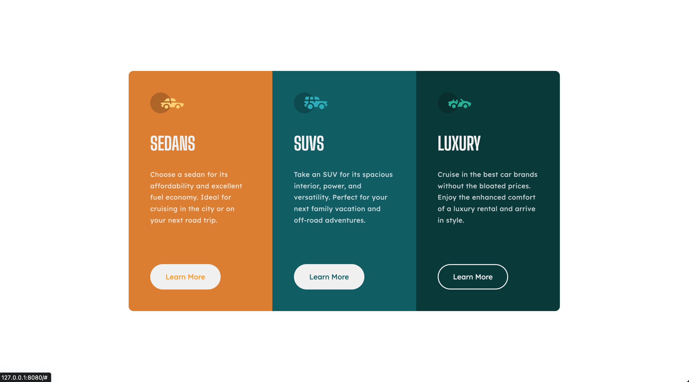

# 3-column preview card component solution - SCSS

### The challenge

Users should be able to:

- View the optimal layout depending on their device's screen size
- See hover states for interactive elements

### Screenshot

### Link

- [Live Site URL](https://pjevic.github.io/3-column-preview-card-component-SCSS/)

## Author

- Milan Pjevic - [@pjevic](https://www.frontendmentor.io/profile/pjevic)
